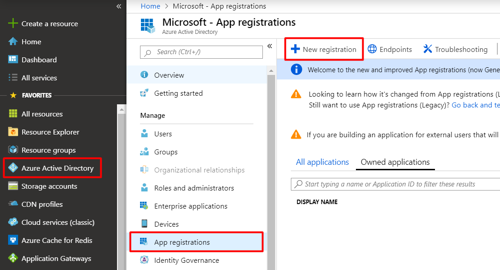
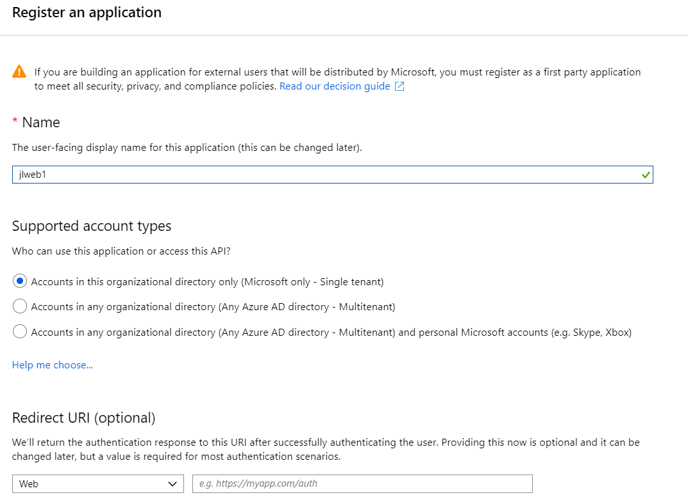
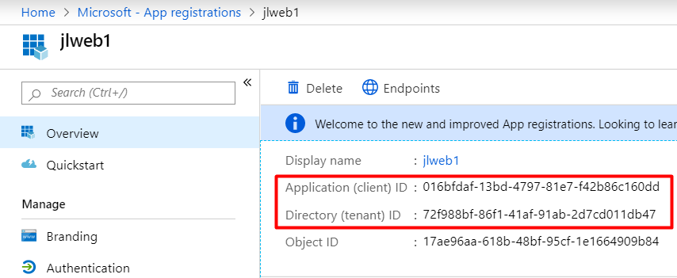
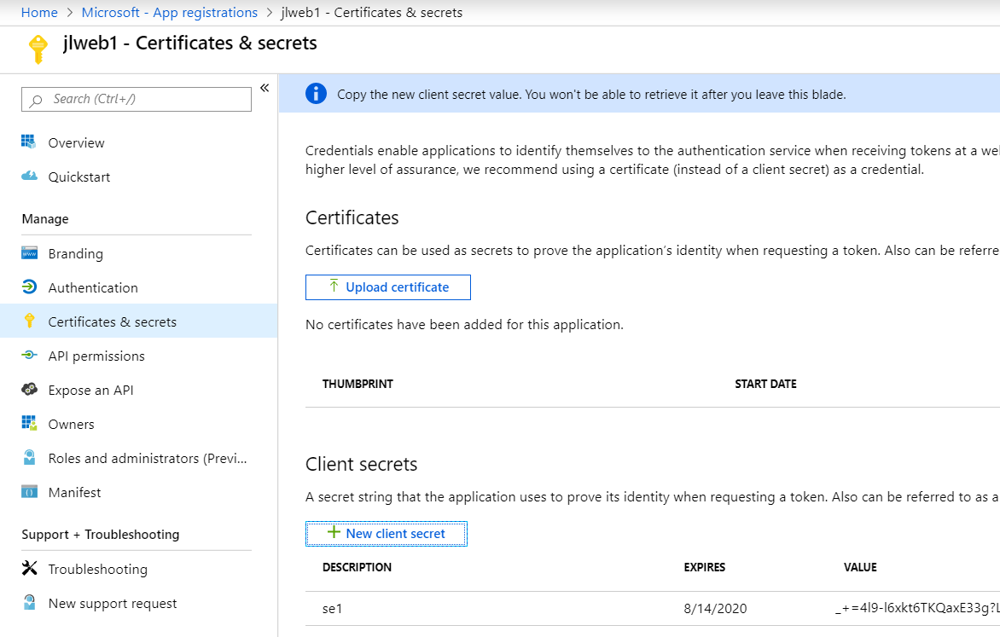
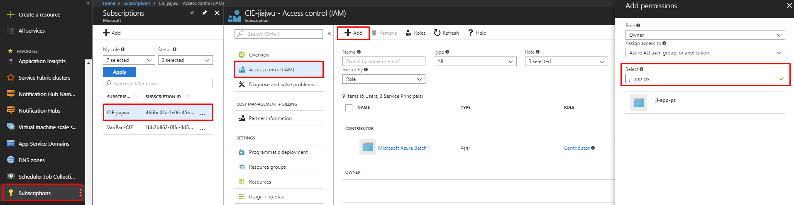

# Create Service Principal in Azure Portal and Assign Permissions

A **Service Principal** is an **AAD Application**'s representation in a tenant, or "an identity for the app". It can be added like a user in Azure's [Role-Based Access Control](https://docs.microsoft.com/en-us/azure/active-directory/role-based-access-control-configure).

This article follows [official doc](https://docs.microsoft.com/en-us/azure/active-directory/develop/howto-create-service-principal-portal), shows **how to do this in GUI** and provides more detailed screenshots and explanations.

## Create Service Principal in Azure Portal

1. Create a new application in your AAD. Go to **Azure Portal** > **Azure Active Directory** > **App registration** > **New application registration**

	

2. Give it a name. Sign-on URL is not needed.

	

3. Mark down the **Application (client) ID** and **Directory (tenant) ID**. Microsoft's Directory ID is `72f988bf-86f1-41af-91ab-2d7cd011db47`

    

4. Create a new **Client Secret**. 
	
	

4. Go to the resource you want to give the Service Principal permission, at different levels. **Subscription** / **Resource Group** / **Resource** > **Access control (IAM)**

	

