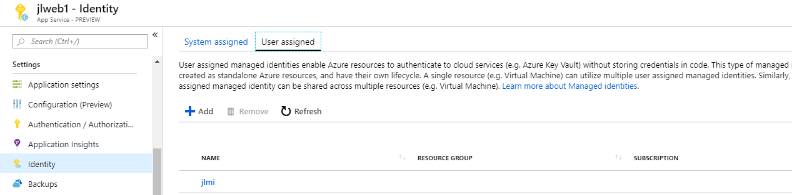
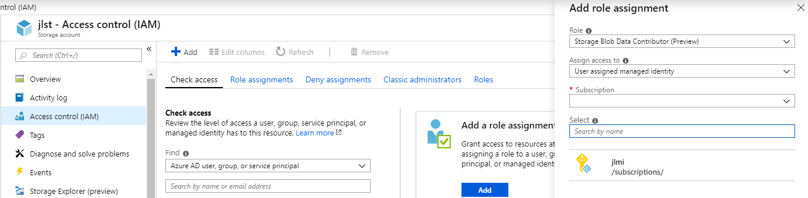

# Use Managed Identities in App Service with HTTP REST Protocol

## Create resources and grant permissions

Under App Service’s Identity, enable **system-assigned identity** or **user-assigned identity**.



Then add it to target resource’s **Access control (IAM)**.  



## Get access token

### System-assigned identity

For system-assigned identity the easiest way is to [use `AzureServiceTokenProvider`](https://docs.microsoft.com/en-us/azure/app-service/overview-managed-identity#asal).

### User-assigned identity

`AzureServiceTokenProvider` currently doesn't work with user-assigned identity. Though [Connection String doc](https://docs.microsoft.com/en-us/azure/key-vault/service-to-service-authentication#connection-string-support) says `RunAs=App;AppId={ClientId of user-assigned identity}` is for user-assigned identify, it currently doesn't work and returns error `Connection string RunAs=App;AppId=xxx is not valid. Must contain 'TenantId' attribute and it must not be empty.`

To get token for user-assigned identity, we need to [use HTTP REST protocol](https://docs.microsoft.com/en-us/azure/app-service/overview-managed-identity#using-the-rest-protocol).

### C# implementation using HTTP REST protocol

```csharp
/// <summary>
/// Get managed identity token.
/// </summary>
/// <param name="resource">The AAD resource URI of the resource for which a token should be obtained. </param>
/// <param name="apiversion">The version of the token API to be used. "2017-09-01" is currently the only version supported.</param>
/// <param name="clientId">(Optional) The ID of the user-assigned identity to be used. If omitted, the system-assigned identity is used.</param>
/// <returns>A Bearer token ready to be used with AAD-authenticated REST API calls.</returns>
public static async Task<string> GetToken(string resource, string apiversion, string clientId = null)
{
    HttpClient client = new HttpClient();
    client.DefaultRequestHeaders.Add("Secret", Environment.GetEnvironmentVariable("MSI_SECRET"));

    string url;
    if (clientId == null)
    {
        // Get system-assigned identity token
        url = String.Format("{0}?resource={1}&api-version={2}", Environment.GetEnvironmentVariable("MSI_ENDPOINT"), resource, apiversion);
    }
    else
    {
        // Get user-assigned identity token
        url = String.Format("{0}?resource={1}&api-version={2}&clientid={3}", Environment.GetEnvironmentVariable("MSI_ENDPOINT"), resource, apiversion, clientId);
    }

    HttpResponseMessage responseMessage = await client.GetAsync(url);
    string content = await responseMessage.Content.ReadAsStringAsync();

    // using System.Web.Script.Serialization;
    //JavaScriptSerializer j = new JavaScriptSerializer();
    //Dictionary<string, string> list = (Dictionary<string, string>)j.Deserialize(content, typeof(Dictionary<string, string>));
    //string accessToken = list["access_token"];

    // using using Newtonsoft.Json.Linq;
    var result = JObject.Parse(content);
    string accessToken = result["access_token"].ToString();

    return accessToken;
}
```

Sample `HttpResponseMessage`:

```json
{
  "access_token": "eyJ0e...",
  "expires_on": "3/21/2019 11:39:40 AM +00:00",
  "resource": "https://storage.azure.com/",
  "token_type": "Bearer"
}
```

Then the access token can be used to access resources like [Azure Storage](https://docs.microsoft.com/en-us/azure/storage/common/storage-auth-aad-msi#create-credentials-from-the-managed-identity-access-token). 

For example, to use `GetToken()` in ASP.NET MVC controller:

```csharp
public async Task<ActionResult> About()
{
    var accessToken = await GetToken("https://storage.azure.com/", "2017-09-01", "b5c6a0ef-e0a6-4a01-a95d-a0cdb0223777");

    Console.WriteLine(accessToken);
    // Create storage credentials from your managed identity access token.
    TokenCredential tokenCredential = new TokenCredential(accessToken);
    StorageCredentials storageCredentials = new StorageCredentials(tokenCredential);

    // Create a block blob using the credentials.
    CloudBlockBlob blob = new CloudBlockBlob(new Uri("https://xxx.blob.core.windows.net/xxx/xxx.txt"), storageCredentials);
    blob.UploadText("test");

    ViewBag.Message = accessToken;
    return View();
}
```

## A complete ASP.NET MVC sample Controller

```csharp
using Microsoft.WindowsAzure.Storage.Auth;
using Microsoft.WindowsAzure.Storage.Blob;
using Newtonsoft.Json.Linq;
using System;
using System.Net.Http;
using System.Threading.Tasks;
using System.Web.Mvc;

namespace mvcmi.Controllers
{
    public class HomeController : Controller
    {
        public ActionResult Index()
        {
            return View();
        }

        public async Task<ActionResult> About()
        {
            var accessToken = await GetToken("https://storage.azure.com/", "2017-09-01", "b5c6a0ef-e0a6-4a01-a95d-a0cdb0223777");

            Console.WriteLine(accessToken);
            // Create storage credentials from your managed identity access token.
            TokenCredential tokenCredential = new TokenCredential(accessToken);
            StorageCredentials storageCredentials = new StorageCredentials(tokenCredential);

            // Create a block blob using the credentials.
            CloudBlockBlob blob = new CloudBlockBlob(new Uri("https://jlst.blob.core.windows.net/pic/Blob1.txt"), storageCredentials);
            blob.UploadText("test");

            ViewBag.Message = accessToken;
            return View();
        }

        /// <summary>
        /// Get managed identity token.
        /// </summary>
        /// <param name="resource">The AAD resource URI of the resource for which a token should be obtained. </param>
        /// <param name="apiversion">The version of the token API to be used. "2017-09-01" is currently the only version supported.</param>
        /// <param name="clientId">(Optional) The ID of the user-assigned identity to be used. If omitted, the system-assigned identity is used.</param>
        /// <returns>A Bearer token ready to be used with AAD-authenticated REST API calls.</returns>
        public static async Task<string> GetToken(string resource, string apiversion, string clientId = null)
        {
            HttpClient client = new HttpClient();
            client.DefaultRequestHeaders.Add("Secret", Environment.GetEnvironmentVariable("MSI_SECRET"));

            string url;
            if (clientId == null)
            {
                // Get system-assigned identity token
                url = String.Format("{0}?resource={1}&api-version={2}", Environment.GetEnvironmentVariable("MSI_ENDPOINT"), resource, apiversion);
            }
            else
            {
                // Get user-assigned identity token
                url = String.Format("{0}?resource={1}&api-version={2}&clientid={3}", Environment.GetEnvironmentVariable("MSI_ENDPOINT"), resource, apiversion, clientId);
            }

            HttpResponseMessage responseMessage = await client.GetAsync(url);
            string content = await responseMessage.Content.ReadAsStringAsync();

            var result = JObject.Parse(content);
            string accessToken = result["access_token"].ToString();

            return accessToken;
        }

        public ActionResult Contact()
        {
            ViewBag.Message = "Your contact page.";

            return View();
        }
    }
}
```
