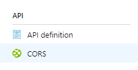

# Enable CORS on Azure CDN with Azure App Service

As Azure CDN currently [doesn’t support Vary: Origin header](https://feedback.azure.com/forums/169397-cdn/suggestions/6275266-cdn-support-vary-origin-header), enabling CORS on CDN with App Service can be tricky. 
There are two ways to do this. 

## In App Service CORS blade


 
If CORS is configured here, only when the request contains CORS headers, like 

```http
Origin: https://xxx.mydomain.com
Access-Control-Request-Method: GET
Access-Control-Request-Headers: authorization,content-type
```

the response will contain CORS headers, like 

```http
Access-Control-Allow-Origin: https://www.mydomain.com
Access-Control-Allow-Headers: *
Access-Control-Allow-Methods: GET,HEAD,OPTIONS
Access-Control-Expose-Headers: *
```

In other words, if the request doesn’t have CORS headers, the response won’t have CORS headers either. 

If you set CORS in this way, you need to make sure the URLs that need CORS are **never** visited with non-CORS request, so that CDN can cache the correct response with CORS. Otherwise, CDN may cache the non-CORS reponse and following CORS requests will fail.

## In Web.config

If configured in Web.config, App Service's response will contain CORS headers consistently regardless of whether the request has CORS headers. 

In order to do this, you can [update web.config](https://docs.microsoft.com/en-us/iis/configuration/system.webserver/httpprotocol/customheaders/#configuration-sample) to [add CORS related headers](https://docs.microsoft.com/en-us/azure/cdn/cdn-cors#one-regular-expression-with-all-valid-origins).

```xml
<configuration>
   <system.webServer>
      <httpProtocol>
         <customHeaders>
            <add name="Access-Control-Allow-Origin" value="https://www.mydomain.com" />
            <add name="Access-Control-Allow-Headers" value="*" />
            <add name="Access-Control-Allow-Methods" value="GET,HEAD,OPTIONS" />
            <add name="Access-Control-Expose-Headers" value="*" />
         </customHeaders>
      </httpProtocol>
   </system.webServer>
</configuration>
```

Finnally, don't forget to purge CDN to make sure the response headers are reloaded. 

## curl command for testing 

```batch
curl -X OPTIONS "https://cdn.mydomain.com" -H "Origin: www.mydomain.com" -H "Access-Control-Request-Method: GET" -H "Access-Control-Request-Headers: authorization,content-type" -D - -s -o nul
```

Sample response
```http
HTTP/2 200
access-control-allow-credentials: true
access-control-allow-headers: authorization,content-type
access-control-allow-methods: GET
access-control-allow-origin: www.mydomain.com
...
```
