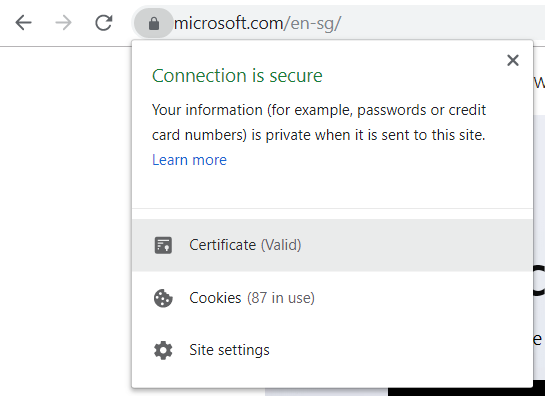
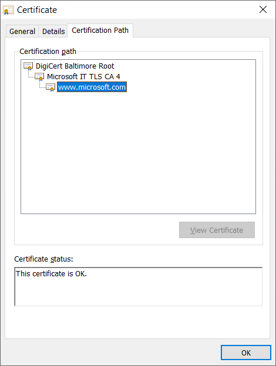
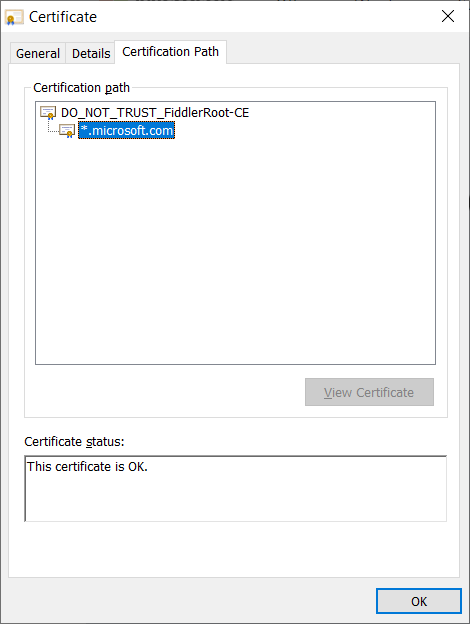
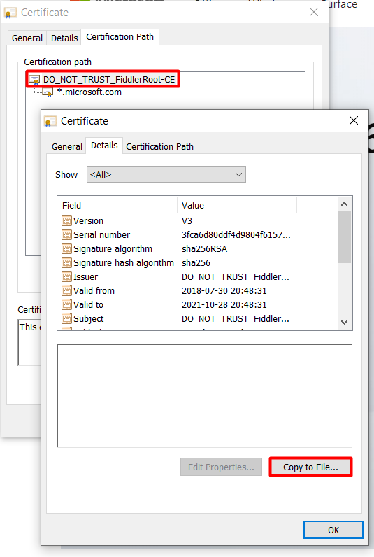
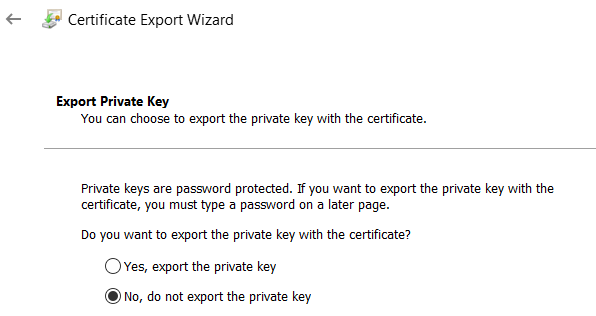
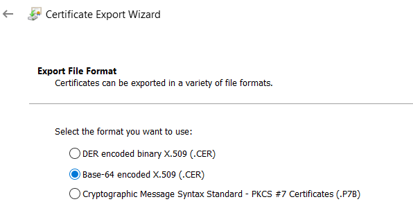
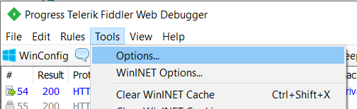
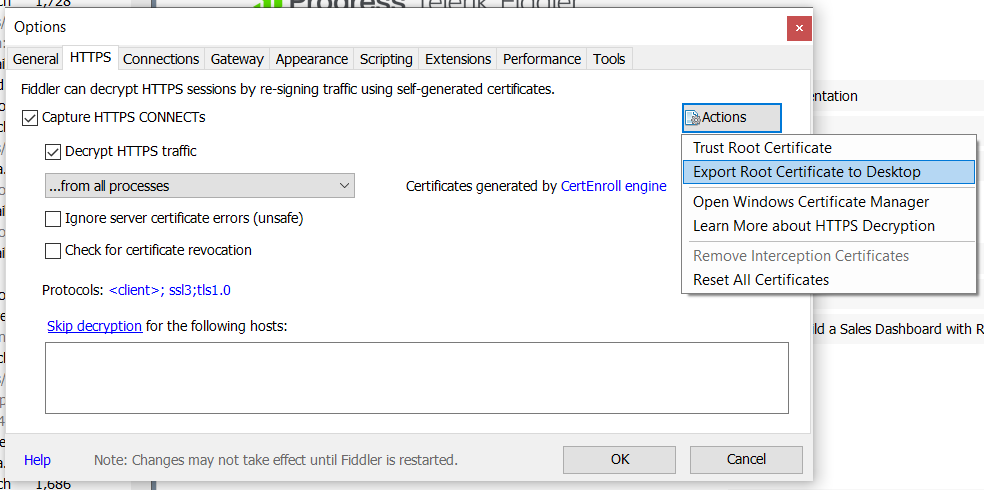

# Use Azure CLI behind a proxy

> The official guidance is at https://github.com/Azure/azure-cli/blob/dev/doc/use_cli_effectively.md#working-behind-a-proxy. The following contents includes more detailed instructions.

Sometimes we may want to capture Fiddler trace for Azure CLI, or the company's network is forced to use a proxy and the proxy is intercepting HTTPS traffic using a self-signed certificate. In such case, Python [requests library] which CLI depends on will throw `SSLError("bad handshake: Error([('SSL routines', 'tls_process_server_certificate', 'certificate verify failed')],)",)`. Some configurations are needed on Azure CLI to make it work properly. 

The best way to check if HTTPS is intercepted by a proxy is to check with Chrome. (If the proxy is not intercepting HTTPS, it won't bother CLI, so we don't need below steps.)  

Click on the 🔒 icon to the left of the URL and select **Certificate**.



If HTTPS traffic is not intercepted, the root CA should be a public CA, like DigiCert.



If HTTPS traffic is intercepted by the proxy, the root CA should be a self-signed certificate or a certificate issued by the company's IT department, something like:



There are 2 ways to handle this error.

## Add certificate to CA bundle

This is recommended if you use CLI frequently behind a corporate proxy. 

- If `REQUESTS_CA_BUNDLE` is not set, [requests library] reads from the default location: `C:\Program Files (x86)\Microsoft SDKs\Azure\CLI2\Lib\site-packages\certifi\cacert.pem` on Windows and ` /opt/az/lib/python3.6/site-packages/certifi/cacert.pem` on Linux. You may append the proxy's certificate to `cacert.pem`:
    ```
    <Original cacert.pem>

    -----BEGIN CERTIFICATE-----
    <Your proxy's certificate here> 
    -----END CERTIFICATE-----
    ```
- If `REQUESTS_CA_BUNDLE` is set, [requests library] reads the CA bundle from this location. The CA bundle should look like `cacert.pem` in PEM (Privacy Enhanced Mail) format

To export the proxy's certificate, 




Select **No, do not export the private key**.



Select **Base-64 encoded X.509 (.CER)**.



Alternative way for Fiddler:





The certificate needs to be opened and converted to **Base-64 encoded** following the above steps.

A frequent ask is whether or not `HTTP_PROXY` or `HTTPS_PROXY` environment variables should be set, the answer is it depends. For fiddler on Windows, by default it acts as system proxy on start, you don't need to set anything. If the option is off or using other tools which don't work as system proxy, you should set them. Since almost all traffics from CLI are SSL based, so only `HTTPS_PROXY` should be set. If you are not sure, just set them, but do remember to unset it after the proxy is shut down. For fiddler, the default value is `http://localhost:8888`.

For other details, check out [Stefan's blog](https://blog.jhnr.ch/2018/05/16/working-with-azure-cli-behind-ssl-intercepting-proxy-server/).

[requests library]: https://github.com/kennethreitz/requests

## Disable SSL verification

Disable the certificate check across the CLI by setting the environment variable of `AZURE_CLI_DISABLE_CONNECTION_VERIFICATION` to any value. This is not safe, but good for a short period like you want to capture a trace for a specific command and promptly turn it off after done. This currently doesn't work with data-plane operations, like [azure-storage-python](https://github.com/Azure/azure-storage-python), because the library doesn't have a built-in way to disable SSL verification. 

> Currently this method doesn't work for some data-plane commands, because the SDKs Azure CLI depends on don't expose an env var to disable SSL verification. 

### CMD

```batch
set AZURE_CLI_DISABLE_CONNECTION_VERIFICATION=1
```

### PowerShell

`set` doesn't work in PowerShell because PowerShell's `set` is an alias to `Set-Variable`, which only changes the script's variables. See [about_environment_variables](https://docs.microsoft.com/en-us/powershell/module/microsoft.powershell.core/about/about_environment_variables?view=powershell-6).

```powershell
$Env:AZURE_CLI_DISABLE_CONNECTION_VERIFICATION=1
```

### Linux

```bash
export AZURE_CLI_DISABLE_CONNECTION_VERIFICATION=1
```
