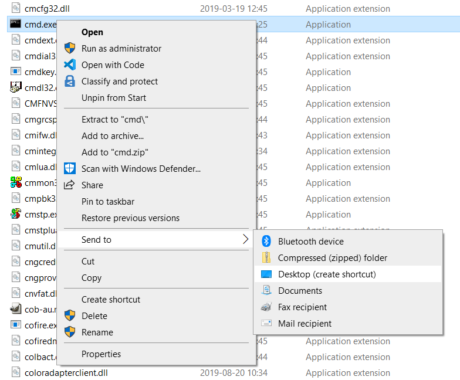
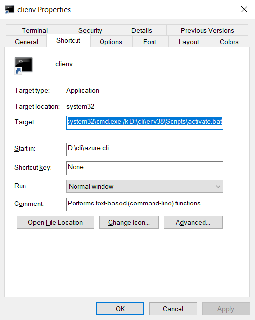

# Tips for using azdev effectively

## Create a one-click shortcut to activate the dev virtual env on Windows

For CMD,

1. Create a shortcut for `C:\Windows\System32\cmd.exe`
    1. Open File Explorer, navigate to `C:\Windows\System32\` and find `cmd.exe`
    2. Right click, select **Send to** -> **Desktop (create shortcut)**

        

3. Go to desktop, right click the shortcut and open `Properties` or select the shortcut and press <kbd>Alt</kbd>+<kbd>Enter</kbd>
4. Change **Target** to `%windir%\system32\cmd.exe /k <virtual_env>\Scripts\activate.bat` and **Start in** to the path you want to start with

    

For PowerShell, the method is similar. The executable is at `C:\Windows\System32\WindowsPowerShell\v1.0\powershell.exe` and the **Target** for the shortcut is `%windir%\System32\WindowsPowerShell\v1.0\powershell.exe -NoExit -File <virtual_env>\Scripts\Activate.ps1`

Also see:

cmd.exe: https://docs.microsoft.com/en-us/windows-server/administration/windows-commands/cmd

powershell.exe: https://docs.microsoft.com/en-us/powershell/module/microsoft.powershell.core/about/about_powershell_exe?view=powershell-5.1

