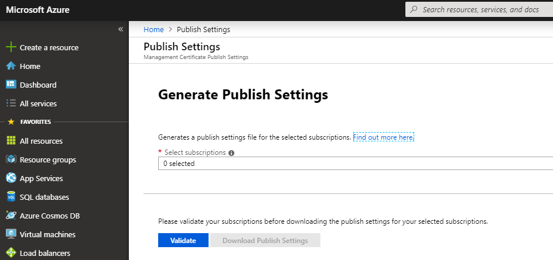
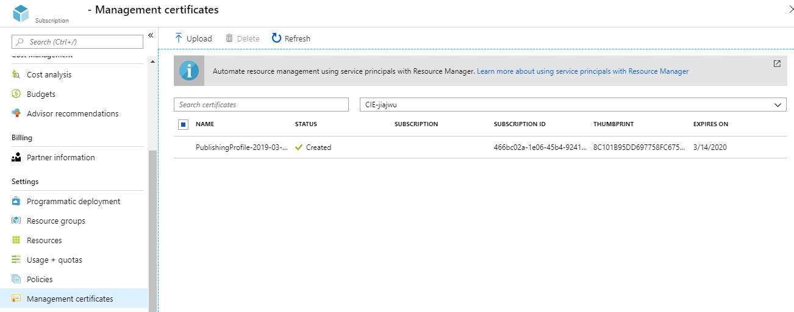

# Delete Cloud Service Role Instance with PowerShell

For Azure Classic Cloud Service, sometimes user may want to delete certain instances. This can't be done in Azure Portal or PowerShell CmdLet. Here shows how to use PowerShell to call REST API [Delete Role Instances](https://docs.microsoft.com/en-us/rest/api/compute/cloudservices/rest-delete-role-instances) to achieve this.

# Steps
[Install classic PowerShell module](https://docs.microsoft.com/en-us/powershell/azure/install-az-ps) if not installed before. This requires PowerShell to be run as Administrator.

```powershell
Install-Module -Name Azure -AllowClobber
```

Download Azure Management Certificate. Following command will open Azure Portal. Then click Validate and download it.

```powershell
Get-AzurePublishSettingsFile
```



Import Azure Management Certificate. Please replace the file name with the correct one.

```powershell
Import-AzurePublishSettingsFile "C:\Users\xxx\Downloads\xxxxx.publishsettings"
```

Copy certificate thumbprint from Azure Portal **All services > Subscriptions > Management certificates**. The certificate name should have today’s timestamp.



Set instance name.

```powershell
$xml = '<RoleInstances xmlns="http://schemas.microsoft.com/windowsazure" xmlns:i="http://www.w3.org/2001/XMLSchema-instance"><Name>WebRole1_IN_1</Name></RoleInstances>'
``` 

Set certificate thumbprint.

```powershell
$certificateThumb = "8C101B95DD697758FC675854FB770BBDE3XXXXXX"
```
 
Call REST API. Please confirm subscription ID and Cloud Service name are correct. 

```powershell
Invoke-WebRequest -Uri "https://management.core.windows.net/<subscription-id>/services/hostedservices/<cloudservice-name>/deployments/<deployment-name>/roleinstances/?comp=delete" -CertificateThumbprint $certificateThumb -Method POST -Body $xml -Headers @{"x-ms-version"="2013-08-01"} -ContentType "text/xml" 
```

## Full Script

```powershell
# Install classic PowerShell module if not installed before
Install-Module -Name Azure -AllowClobber

Get-AzurePublishSettingsFile
Import-AzurePublishSettingsFile "D:\ps\my.publishsettings"

$xml = '<RoleInstances xmlns="http://schemas.microsoft.com/windowsazure" xmlns:i="http://www.w3.org/2001/XMLSchema-instance"><Name>WebRole1_IN_1</Name></RoleInstances>'
$certificateThumb = "8C101B95DD697758FC675854FB770BBDE3XXXXXX"

# Call REST API https://docs.microsoft.com/en-us/rest/api/compute/cloudservices/rest-delete-role-instances 
Invoke-WebRequest -Uri "https://management.core.windows.net/<subscription-id>/services/hostedservices/<cloudservice-name>/deployments/<deployment-name>/roleinstances/?comp=delete" -CertificateThumbprint $certificateThumb -Method POST -Body $xml -Headers @{"x-ms-version"="2013-08-01"} -ContentType "text/xml" 
```

## Sample Result

```powershell
StatusCode        : 202
StatusDescription : Accepted
Content           : {}
RawContent        : HTTP/1.1 202 Accepted
                    x-ms-servedbyregion: ussouth3
                    x-ms-request-id: 67e7d89ed46f70a89347d0293b0decce
                    Content-Length: 0
                    Cache-Control: no-cache
                    Date: Thu, 14 Mar 2019 07:58:45 GMT
                    Server: 67.3.0...
Headers           : {[x-ms-servedbyregion, ussouth3], [x-ms-request-id, 67e7d89ed46f70a89347d0293b0decce], [Content-Length, 0], [Cache-Control, no-cache]...}
RawContentLength  : 0	
```
