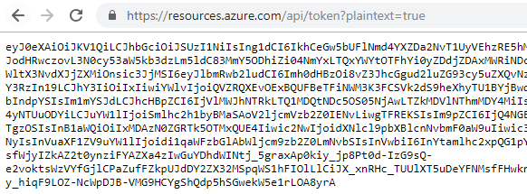
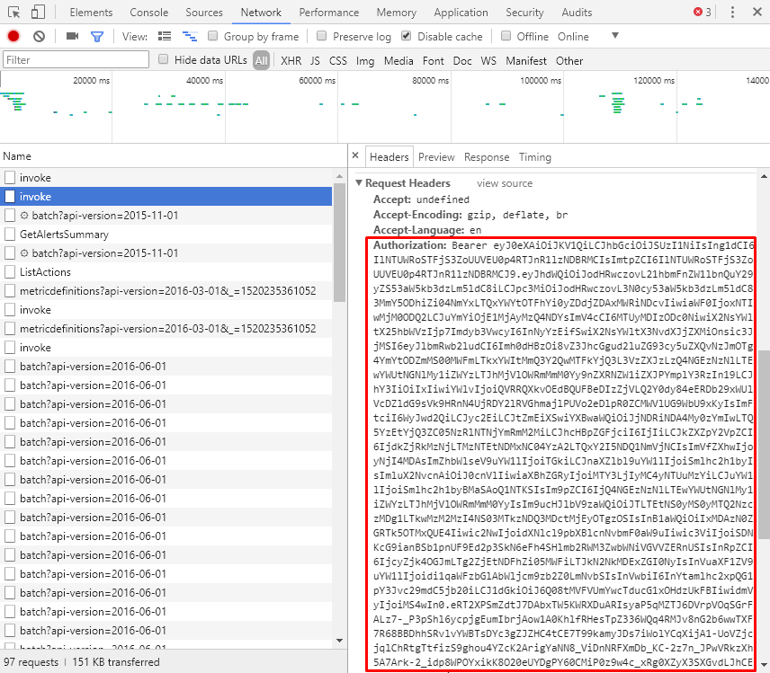

# Invoke Azure REST API with curl

To call a REST API, **Authorization** header is needed authorize the request.

## Method 1: Acquire token from resources.azure.com (Easiest)

Visit <https://resources.azure.com/api/token?plaintext=true> and copy the token. This token is issued for the user that signed in, and is the same as Azure Portal token.



## Method 2: Acquire token from Azure Portal 
For temporary usage, the easiest way is to get the token from Azure Portal - In Developer Tools, find requests like **invoke** and find the **Authorization** header in the request. 



## Method 3: Acquire token using Service Principal

[Create Service Principal in Azure Portal and assign it permissions](../aad/Service-Principal-portal.md), then [get token with curl.](../aad/Service-Principal-get-token-with-curl.md)

## Invoke REST API

Put the **Authorization** header in the request and call curl. For example, 

[Application Gateways - Get](https://docs.microsoft.com/en-us/rest/api/application-gateway/applicationgateways/get):

```Batchfile
curl "https://management.azure.com/subscriptions/466bc02a-1e06-45b4-9241-395b32d2094c/resourceGroups/jlrg1/providers/Microsoft.Network/applicationGateways/jlwaag?api-version=2017-10-01" -H "Authorization:Bearer eyJ0eX..." -H "Content-Type:application/json" -o output.json -D - -s
```

It saves the response to output.json. Then we can do some changes and PUT it back.

[Application Gateways - Create Or Update](https://docs.microsoft.com/en-us/rest/api/application-gateway/applicationgateways/createorupdate):

```Batchfile
curl -X PUT "https://management.azure.com/subscriptions/466bc02a-1e06-45b4-9241-395b32d2094c/resourceGroups/jlrg1/providers/Microsoft.Network/applicationGateways/jlwaag?api-version=2017-10-01" -H "Authorization:Bearer eyJ0eX..." -H "Content-Type:application/json" -d "@output.json" -D - -s
```

Parameters:

```
-D -: Dump headers to stdout(-)
-s  : Silently, do not show the percentage progress (0%, 1%, ...)
```

Note: If the token is too long, exceeding the limit of a console command, use **Postman** or **Fiddler** instead.

## References

curl download: https://curl.haxx.se/download.html

curl manpage: https://curl.haxx.se/docs/manpage.html